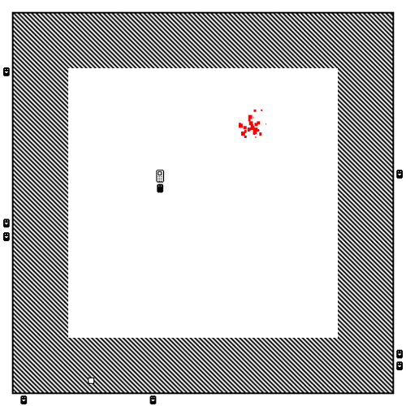

# Everything is Wonderful

## About
_Everything is Wonderful_ is a small game I made in a week in 2014 to experiment with [LÖVE](https://love2d.org/).

The player is constrained to a small space and subject to random inspections, until they can collect components for a bomb and liberate themselves and the guards.

The visual style was influenced by the glyphs in [ZZT](https://en.wikipedia.org/wiki/ZZT), though I didn't realise it at the time.

 

## Installation & Running

Running a LÖVE game from source is fairly straightforward:
* Install the [LÖVE executables](https://love2d.org/)
* Create a zip file with the included .lua files and asset directory at the root of the zip
* Change the zip file's extension from .zip to .love
* On Windows, drag the newly-created .love file onto the love.exe launcher
  * You might need to install some extra libraries (SDL in particular), but that is outside the scope of this document
Further documentation available [here](https://love2d.org/wiki/Game_Distribution).

## Controls
* Arrow keys: move your character around

## Rules & Conditions
* Don't let the inspectors catch you out of bounds
* Wait for your hidey-hole to appear (it will be out of bounds)
* Pick up items and place them in the hidey-hole (when no one is around)
* Once you've assembled your final package, wait for an inspection.

## Links
* The original version of the game is available on [itch.io](https://nicknicknicknick.itch.io/everything-is-wonderful)

## History
* v1.0 (26 December 2014)
  * Initial release
* v1.1 (9 June 2020)
  * Public release
